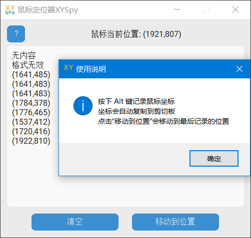

## 需求文档

#### 项目名称：

​						鼠标定位器XYSpy(Mouse Locator XYSpy)

#### 使用 EXE 程序说明：

本项目已使用 PyInstaller 打包为 Windows 平台的独立可执行程序（.exe），无需安装 Python 环境即可运行。



##### 使用步骤：

1. 下载 `XYSpy.exe` 文件（位于发布页面）。
2. 双击运行即可启动图形界面程序，无需安装。
3. 程序运行后将常驻系统托盘，可按 Alt 键记录当前鼠标坐标，坐标将自动复制到剪贴板。
4. 可点击“移动到位置”按钮将鼠标移动至最后记录的位置。
5. 如需退出程序，可在系统托盘右键图标选择“退出”。

##### 注意事项：

若启动时被 Windows Defender SmartScreen 拦截，请选择“仍要运行”。

若程序无法响应或某些窗口下无法监听按键，请尝试右键以管理员身份运行。 

程序使用 UPX 压缩，部分杀毒软件可能误报为可疑，属误报。

##### 系统要求：

支持操作系统：Windows 10 及以上。


#### 项目目标：

- 提供一个简单且高效的工具，帮助用户方便地记录和定位鼠标位置。
- 为用户提供一个轻量级且便于使用的图形化界面。

#### 项目描述：

`鼠标定位器XYSpy(Mouse Locator XYSpy)` 是一款轻量级的鼠标定位工具，允许用户通过按下 `Alt` 键来记录鼠标的当前位置，并将其复制到剪切板。用户可以点击 "移动到位置" 按钮，将鼠标移动到最后记录的位置。此工具的目标是为用户提供便捷的鼠标坐标记录与定位功能。

#### 技术栈：

- **Python**：主编程语言
- **CustomTkinter**：GUI 框架，用于设计跨平台的用户界面
- **PyAutoGUI**：用于获取鼠标位置并模拟鼠标操作
- **Pyperclip**：用于复制坐标到剪贴板
- **Keyboard**：用于监听键盘事件
- **pystray**：用于创建托盘图标
- **Pillow**：用于加载和显示托盘图标
- **locale**：用于检测操作系统的语言环境

#### 项目结构：

```
XYSpy/
│
├── images/                       # 存放图标及其他资源
│   └── xy_logo_com.ico           # 应用程序图标
│
├── XYSpy.py                      # 程序入口，包含主逻辑与界面控制
│
└── README.md                     # 项目说明文档
```

#### 功能需求：

1. **用户界面**：
   - 显示当前鼠标位置。
   - 提供“清空”按钮，清空文本框中的内容。
   - 提供“移动到位置”按钮，将鼠标移动到最后记录的位置。
   - 提供“帮助”按钮，显示应用程序的使用说明。
2. **鼠标位置记录**：
   - 按下 `Alt` 键时，自动记录当前鼠标位置，并将坐标复制到剪贴板。
   - 记录的坐标格式为 `(x, y)`，并在文本框中显示。
3. **移动到位置**：
   - 用户点击“移动到位置”按钮时，程序将鼠标移动到最后记录的坐标位置。
4. **托盘图标**：
   - 在系统托盘显示图标，图标右键菜单提供“退出”选项。
5. **支持多语言**：
   - 根据操作系统的语言环境，自动选择中文或英文显示界面。

#### 系统要求：

- **操作系统**：Windows
- **Python 版本**：3.7 或更高版本
- **所需库**：
  - customtkinter
  - keyboard
  - pyautogui
  - pyperclip
  - pystray
  - Pillow
  - locale

#### 安装说明：

1. 安装 Python 3.7 或更高版本。

2. 克隆本项目到本地：

   ```bash
   git clone https://github.com/your-username/XYSpy.git
   ```

3. 安装所需的 Python 库：

   ```bash
   pip install -r requirements.txt
   ```

4. 运行程序：

   ```bash
   python XYSpy.py
   ```

#### 打包说明：

使用 **PyInstaller** 将程序打包为可执行文件，并使用 **UPX** 压缩打包体积。以下是打包命令：

```bash
pyinstaller --upx-dir=D:\Tool\upx-5.0.0-win64\upx.exe -w --onefile --add-data "images;images" --icon=images\xy_logo_com.ico --manifest admin.manifest --clean XYSpy.py
```

- `--upx-dir`: 指定 UPX 压缩工具的路径（可选）
- `-w` 或 `--windowed`: 不显示命令行窗口
- `--onefile`: 打包为一个单独的可执行文件
- `--add-data`: 包含资源文件（如图标、图片等）
- `--icon`: 设置程序图标
- `--manifest`: 设置 EXE 文件的 manifest，申请管理员权限（可选）
- `--clean`: 清理旧的构建缓存

#### 退出说明：

在程序的托盘图标右键菜单中，点击 "退出" 选项会关闭程序并退出。

#### 错误处理：

- 如果用户尝试移动到无效的坐标格式，系统会提示 "格式无效"。
- 如果鼠标移动失败，系统会提示 "移动失败" 并显示错误信息。

#### 语言支持：

- 支持中文和英文，自动根据系统语言环境进行切换。

#### TODO：

- 支持其他操作系统（如 macOS 和 Linux）。
- 增加设置界面，允许用户自定义快捷键、主题等。

> 此后大概率不会更新代码

#### 版本历史：

- **v1.0.0** (2025-05-01) - 初始发布
  - 完成基本功能：鼠标位置记录、移动、清空文本框。
  - 支持系统托盘图标和右键退出。
  - 支持多语言：中文、英文。
  - 使用 PyInstaller 打包为独立的可执行文件。

#### 许可信息：

本项目使用 **MIT 许可证**。你可以自由使用、修改和分发此代码，前提是包含原始的许可证和版权声明。

详情请参见 MIT License。

#### 免责声明：

本项目及其代码按“原样”提供，不提供任何形式的保证。我们不对因使用本软件所导致的任何直接或间接的损失或损害负责。

